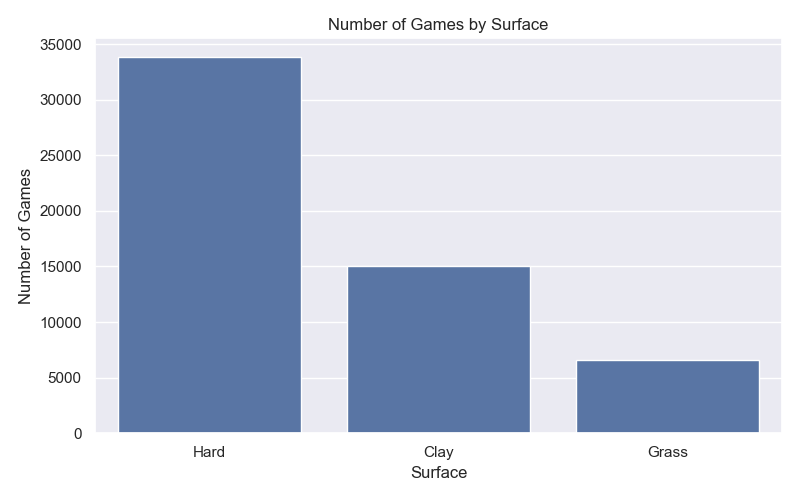
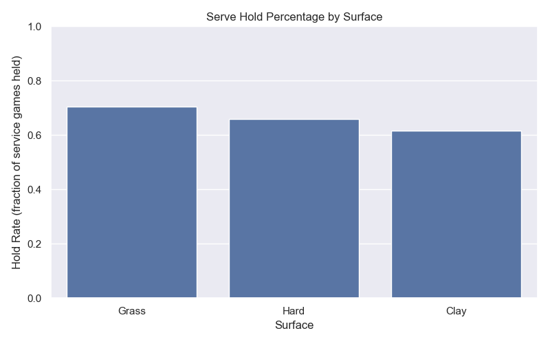

# WTA 2024 Analysis

A comprehensive analysis of the Women's Tennis Association 2024 Points Dataset, examining serve performance across different surfaces and tournaments.

## Project Overview

This project analyzes point-by-point data from the 2024 WTA season, focusing on serve performance metrics and tournament statistics. The analysis includes data cleaning, statistical insights, and visualizations.

## Analysis Results

### Key Statistics

- **Total Game Rows:** 55,457
- **Number of Tournaments:** 57
- **Number of Matches:** 2,558
- **Total Service Games:** 54,821
- **Overall Hold Percentage:** 65.3%

### Games by Surface

| Surface | Number of Games |
|---------|-----------------|
| Hard    | 33,830          |
| Clay    | 15,065          |
| Grass   | 6,562           |

### Serve Hold Percentage by Surface

| Surface | Hold Percentage |
|---------|-----------------|
| Grass   | 70.5%           |
| Hard    | 66.0%           |
| Clay    | 61.6%           |

**Key Insight:** Servers are significantly stronger on grass courts (70.5% hold rate), while clay courts are the most challenging for serving (61.6% hold rate).

## Visualizations

### Figure 1: Number of Games by Surface


### Figure 2: Serve Hold Percentage by Surface


### Figure 3: Number of Games per Month (2024 WTA Season)


## Complete Python Script

```python
"""
WTA 2024 Points Dataset Analysis in Python
"""

# Import necessary libraries
import pandas as pd
import matplotlib.pyplot as plt
import seaborn as sns

# Use a nice default seaborn style for plots
sns.set_theme()

# So that large tables print more nicely
pd.set_option("display.max_columns", 50)
pd.set_option("display.width", 120)


# Load the Excel dataset
file_path = "2024-WTA-Women-Points-Dataset.xlsx"
df = pd.read_excel(file_path, header=1)

print("Data loaded successfully!")
print("\nFirst 5 rows of the dataset:")
print(df.head())

print("\nColumns in the dataset:")
print(df.columns.tolist())


# Data cleaning / formatting
df["MATCH DATE"] = pd.to_datetime(df["MATCH DATE"], errors="coerce")
df["MONTH"] = df["MATCH DATE"].dt.to_period("M")
df["hold"] = (df["WON SERVE"] == "WON").astype(int)
df["is_service_game"] = df["WON SERVE"].isin(["WON", "LOST"]).astype(int)

print("\nBasic cleaning done (dates parsed, helper columns added).")


# Ask some basic questions
num_rows = len(df)
num_tournaments = df["TOURNAMENT ID"].nunique()
num_matches = df["MATCH ID"].nunique()

print("\n--- BASIC STRUCTURE QUESTIONS ---")
print(f"Total rows (roughly individual games): {num_rows}")
print(f"Number of tournaments: {num_tournaments}")
print(f"Number of matches: {num_matches}")

surface_counts = df["SURFACE"].value_counts()
print("\nGames by surface:")
print(surface_counts)

serve_games = df[df["is_service_game"] == 1]
overall_hold_rate = serve_games["hold"].mean()

print("\n--- SERVE PERFORMANCE ---")
print(f"Total service games in dataset: {len(serve_games)}")
print(f"Overall hold percentage: {overall_hold_rate:.1%}")

hold_by_surface = (
    serve_games
    .groupby("SURFACE")["hold"]
    .mean()
    .sort_values(ascending=False)
)

print("\nHold percentage by surface:")
print((hold_by_surface * 100).round(1).astype(str) + "%")


# Plot 1: Games by surface
print("\nCreating Plot 1: Number of games by surface...")

plt.figure(figsize=(8, 5))
sns.barplot(
    x=surface_counts.index,
    y=surface_counts.values
)
plt.title("Number of Games by Surface")
plt.xlabel("Surface")
plt.ylabel("Number of Games")
plt.tight_layout()
plt.show()


# Plot 2: Hold % by surface
print("Creating Plot 2: Serve hold percentage by surface...")

hold_surface_df = hold_by_surface.reset_index()
hold_surface_df.columns = ["SURFACE", "HOLD_RATE"]

plt.figure(figsize=(8, 5))
sns.barplot(
    data=hold_surface_df,
    x="SURFACE",
    y="HOLD_RATE"
)
plt.title("Serve Hold Percentage by Surface")
plt.xlabel("Surface")
plt.ylabel("Hold Rate (fraction of service games held)")
plt.ylim(0, 1)
plt.tight_layout()
plt.show()


# Plot 3: Number of games over time
print("Creating Plot 3: Number of games per month...")

games_per_month = (
    df.dropna(subset=["MONTH"])
      .groupby("MONTH")["MATCH ID"]
      .count()
      .reset_index(name="NUM_GAMES")
)

games_per_month["MONTH"] = games_per_month["MONTH"].astype(str)

plt.figure(figsize=(10, 5))
sns.lineplot(data=games_per_month, x="MONTH", y="NUM_GAMES", marker="o")
plt.title("Number of Games per Month (2024 WTA Season)")
plt.xlabel("Month")
plt.ylabel("Number of Games")
plt.xticks(rotation=45)
plt.tight_layout()
plt.show()


# A couple of concrete "insight" questions
print("\n--- INSIGHT QUESTIONS ---")

top_tournaments = (
    df.groupby(["TOURNAMENT ID", "TOURNAMENT NAME"])["MATCH ID"]
      .count()
      .reset_index(name="NUM_GAME_ROWS")
      .sort_values(by="NUM_GAME_ROWS", ascending=False)
      .head(10)
)

print("\nTop 10 tournaments by number of game-rows:")
print(top_tournaments)

print("\nText summary of serve strength by surface:")
for surface, rate in hold_by_surface.items():
    print(f"- On {surface}, players hold serve about {rate:.1%} of the time.")

print("\nAnalysis finished. You should see three plots and the printed summaries above.")
```

## Top 10 Tournaments by Games

| Rank | Tournament Name   | Game Rows |
|------|------------------|-----------|
| 1    | Australian Open  | 2,753     |
| 2    | French Open      | 2,691     |
| 3    | Wimbledon        | 2,680     |
| 4    | US Open          | 2,613     |
| 5    | Madrid           | 2,139     |
| 6    | Beijing          | 2,105     |
| 7    | Indian Wells     | 2,047     |
| 8    | Rome             | 1,997     |
| 9    | Miami            | 1,986     |
| 10   | Olympic Games    | 1,357     |

## Key Findings

### Serve Strength by Surface

- **On Grass:** Players hold serve about **70.5%** of the time
- **On Hard:** Players hold serve about **66.0%** of the time
- **On Clay:** Players hold serve about **61.6%** of the time

The data clearly shows that grass courts provide the most advantage to servers, likely due to the faster surface and lower bounce characteristics. Clay courts, with their slower surface and higher bounce, make it harder for servers to dominate.

## Technologies Used

- **Python 3.13**
- **pandas** - Data manipulation and analysis
- **matplotlib** - Visualization
- **seaborn** - Statistical data visualization
- **openpyxl** - Excel file handling

## Files in This Repository

- `wta_analysis.py` - Main Python analysis script
- `2024-WTA-Women-Points-Dataset.xlsx` - Source dataset
- `Figure_1.png` - Games by surface visualization
- `Figure_2.png` - Hold percentage by surface visualization
- `Figure_3.png` - Games per month timeline
- `index.html` - Interactive HTML report
- `README.md` - This file

## How to Run

1. Install required packages:
```bash
pip install pandas matplotlib seaborn openpyxl
```

2. Run the analysis script:
```bash
python wta_analysis.py
```

3. View the results and generated plots!

## Insights & Observations

1. **Surface Advantage**: The 9% difference in hold percentage between grass (70.5%) and clay (61.6%) suggests that surface characteristics significantly impact serve performance.

2. **Tournament Distribution**: Grand Slams (Australian Open, French Open, Wimbledon, US Open) account for the highest number of game-rows in the dataset, indicating comprehensive coverage of major tournaments.

3. **Seasonal Pattern**: The line chart shows how tournament frequency varies throughout the 2024 WTA season, with peaks during major tournament weeks.

4. **Hard Court Dominance**: Hard courts represent the majority of games (33,830 out of 55,457), reflecting the prevalence of hard court tournaments in the WTA calendar.

## Notes

This analysis focuses on serve hold/break statistics as a key performance indicator. Future analyses could explore:
- Player-specific serve performance
- Break point conversion rates
- Set-by-set performance trends
- Correlation between surface and player nationality

---

**Last Updated:** December 2024  
**Dataset:** 2024 WTA Women's Tennis Points Dataset  
**Analysis Version:** 1.0
